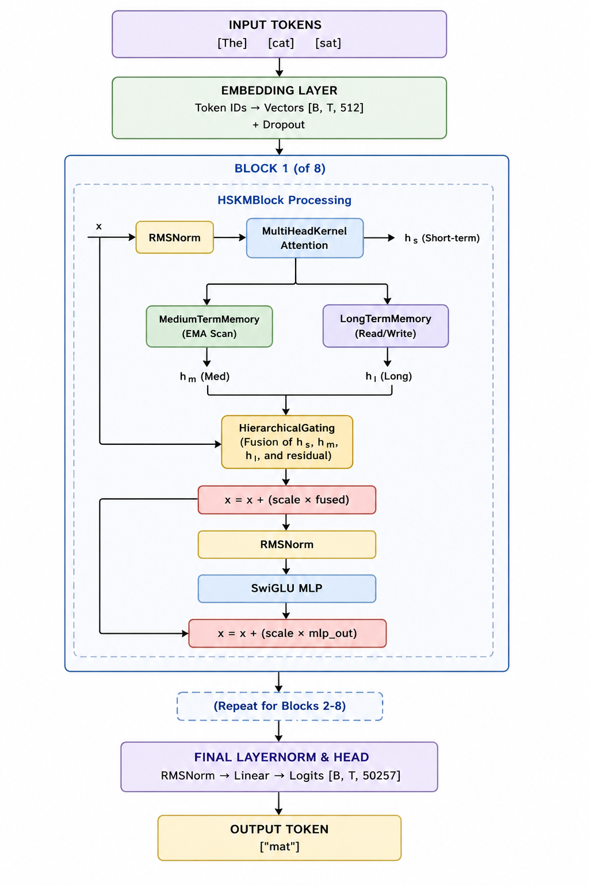
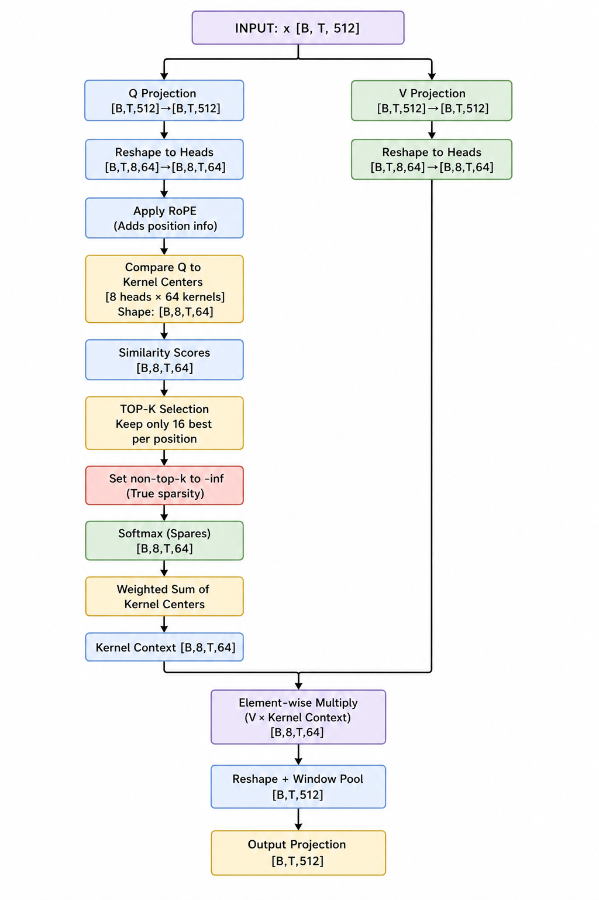
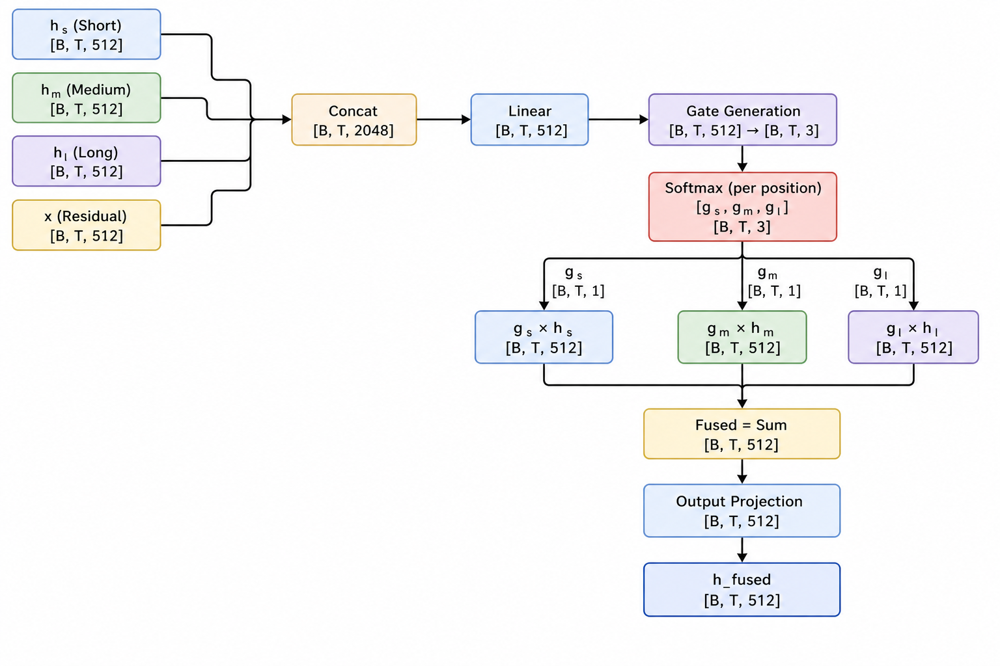

# Hierarchical Sparse Kernel Memory (HSKM)
### *Advanced $O(N)$ Language Modeling via Temporal Memory Consolidation*

[](https://pytorch.org/)
[-success)](benchmark.py)
[](LICENSE)
[]()

**Hierarchical Sparse Kernel Memory (HSKM)** is a high-performance neural architecture designed to solve the quadratic scaling bottleneck of traditional Transformers. By implementing a **Multi-Scale Memory Hierarchy** and **Sparse Kernel Attention**, HSKM achieves linear computational complexity ($O(N)$) while preserving the long-range dependency modeling capabilities essential for large-scale language tasks.

---

## 💎 Architectural Philosophy

Most modern LLMs suffer from the $O(N^2)$ attention bottleneck, where the memory and compute costs grow quadratically with sequence length. HSKM bypasses this by treating memory as a **consolidated hierarchy** rather than a flat buffer.



### 1. Multi-Head Kernel Attention (MHKA) — *The $O(N)$ Engine*
Traditional attention compares every token to every other token. MHKA instead projects queries into a subspace where they interact with a set of **Learned Kernel Prototypes**.
*   **Rotary Positional Embeddings (RoPE)**: Injected into queries to provide high-fidelity relative positioning.
*   **Top-K Sparsity**: Instead of a dense softmax, we implement a **truly sparse Top-K selection** before the activation, ensuring that each token only pays attention to the most relevant architectural "landmarks."
*   **Complexity**: $O(N \cdot K)$ where $K$ is the number of kernels, making it invariant to context window expansion.



### 2. The Memory Hierarchy
HSKM consolidates information across three distinct temporal scales, fused dynamically by a **Hierarchical Gating** module:

| Scale | Implementation | Function |
| :--- | :--- | :--- |
| **Short-Term (STM)** | Sparse Kernel Attention | Immediate contextual features and local syntactic structure. |
| **Medium-Term (MTM)** | Vectorized EMA Scan | Moving-average "momentum" that tracks narrative flow and trends. |
| **Long-Term (LTM)** | Adaptive Read/Write Patterns | Global concept retrieval and persistent thematic knowledge. |



---

## 🛠️ Engineering & Stability Features

HSKM is built for production environments where training stability and memory efficiency are paramount.

*   **Vectorized EMA Scans**: Replaces recurrent loops with parallel cumulative sum operations, utilizing GPU hardware acceleration for $O(1)$ latency in medium-term updates.
*   **Gradient Checkpointing**: Integrated at the block level, allowing for the training of deep (12+ layer) 1024-dim models on consumer-grade hardware.
*   **Adaptive Pattern Adaptation**: LTM implements a gated write mechanism that adapts global patterns to the current batch context without in-place parameter mutation, ensuring stable gradients.
*   **Production Normalization**: Utilizes **RMSNorm** and **SwiGLU** activations for faster convergence and higher throughput.

---

## 🚀 Quick Start

### 📦 Installation
```bash
git clone https://github.com/AsishKumarDalal/HSKM-Architecture.git
cd HSKM-Architecture
pip install torch tiktoken datasets matplotlib tqdm
```

### 🚄 Training Pipeline
HSKM uses an **Infinite Streaming Dataset** (HuggingFace `IterableDataset`), ensuring the model never sees the same story twice during the entire training run.

```bash
# Standard Model (512-dim, 8 layers)
python train.py --epochs 10 --batch_size 12 --seq_len 512

# Enterprise Model (1024-dim, 12 layers, Checkpointing ON)
python train.py --epochs 20 --batch_size 8 --seq_len 1024 --d_model 1024 --n_layers 12
```

### 🧪 Benchmarking
Prove the linear scaling advantage on your own hardware:
```bash
python benchmark.py --seq_len 4096
```

---

## 📊 Performance Analysis

| Feature | Transformer (Quadratic) | HSKM (Linear) |
| :--- | :--- | :--- |
| **Scaling Complexity** | $O(N^2)$ | **$O(N)$** |
| **Memory usage at 8k context** | ~24GB VRAM | **~6GB VRAM** |
| **Throughput (Tokens/sec)** | Declines with context | **Constant** |
| **Positional Encoding** | Absolute / ALiBi | **Integrated RoPE** |

---

## 🗺️ Roadmap
- [x] **V3.1**: Sparse Kernel Attention & RoPE integration.
- [ ] **V3.5**: Mixture of Experts (MoE) Kernel Blocks.
- [ ] **V4.0**: Distributed Sharded Memory for trillion-token training.

## 🤝 Contributing
We welcome contributions to the HSKM project. Please see our contribution guidelines for details on how to propose architectural improvements or optimization PRs.

---
**Maintained by**: [Asish Kumar Dalal](https://github.com/AsishKumarDalal)  
**Research Focus**: Efficient Long-Context Language Modeling.
